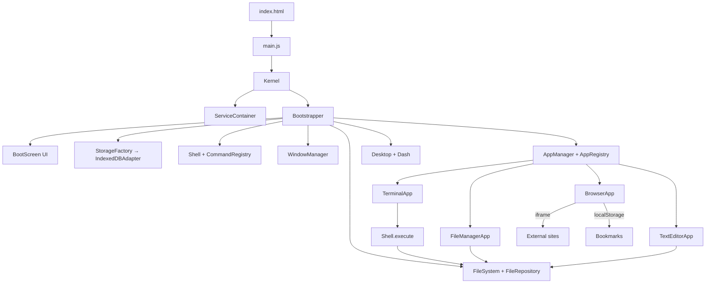
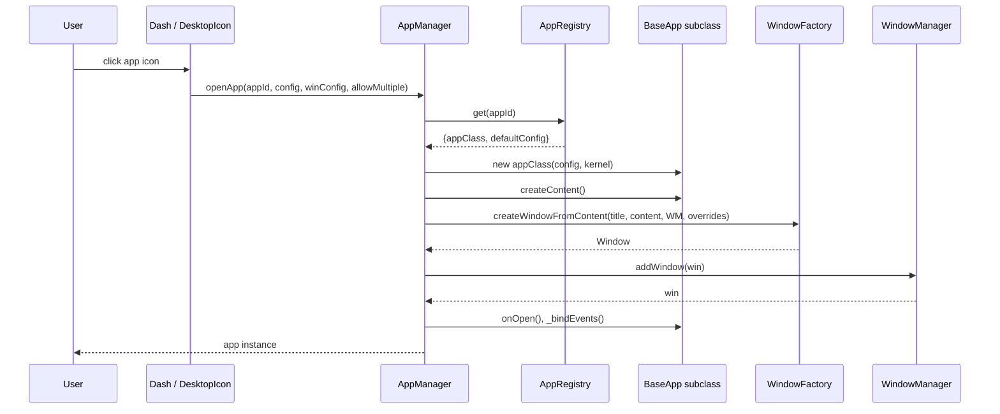
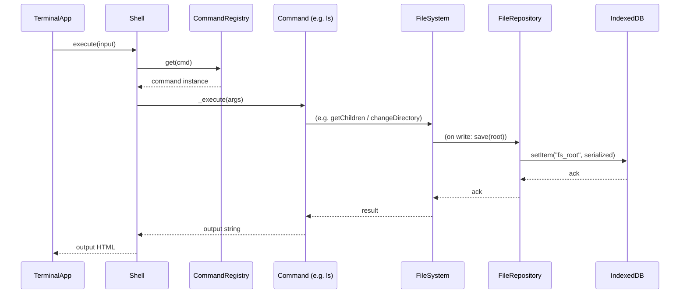

# Architecture — MIN-OS (JK OS)

High-level architecture, components, data flows, and design decisions for the browser-based desktop OS simulation.

## System diagram



## Components and responsibilities

| Component | File | Responsibility |
|---|---|---|
| `Kernel` | `src/core/kernel/Kernel.js` | Top-level orchestrator; holds `ServiceContainer` and `Bootstrapper` |
| `ServiceContainer` | `src/core/kernel/serviceContainer.js` | DI registry: `register`/`get`/`has`/`listService` |
| `Bootstrapper` | `src/core/kernel/bootStrapper.js` | Sequential boot: storage → fs → shell → windows → apps → desktop → session |
| `WindowManager` | `src/core/window-manager/WindowManager.js` | Window stack, z-index, focus, add/close/destroy |
| `Window` | `src/core/window-manager/Window.js` | Draggable/resizable window with minimize/maximize/close |
| `WindowFactory` | `src/core/window-manager/WindowFactory.js` | Creates `Window` from content + title + state overrides |
| `WindowRenderer` | `src/core/window-manager/WindowRenderer.js` | DOM creation/update for window chrome |
| `WindowState` | `src/core/window-manager/WindowState.js` | Immutable-ish geometry model (x, y, w, h, zIndex, minimized, maximized) |
| `AppManager` | `src/core/app-manager/AppManager.js` | Launches apps, tracks instances, single-instance guard |
| `AppRegistry` | `src/core/app-manager/AppRegistry.js` | `appId → {appClass, defaultConfig}` map |
| `BaseApp` | `src/core/app-manager/BaseApp.js` | Abstract app shell: `createContent`, lifecycle hooks |
| `FileSystem` | `src/filesystem/services/FileSystem.js` | Virtual FS: CRUD, cwd, path resolution, search, autocomplete |
| `FileRepository` | `src/filesystem/services/FileRepository.js` | Serialization/deserialization to storage |
| `PathResolver` | `src/filesystem/services/PathResolver.js` | Absolute/relative path walking, `..`, `.`, `basename`, `parent` |
| `FileTypeRegistry` | `src/filesystem/services/FileTypeRegistery.js` | Extension → MIME map |
| `FileTrie` / `TrieNode` | `src/filesystem/constants/` | Prefix trie for autocomplete |
| `Shell` | `src/terminal/shell/Shell.js` | Command dispatch |
| `CommandRegistry` | `src/terminal/utils/commandRegistry.js` | `name → command` map |
| Commands | `src/terminal/commads/*.js` | `ls cd mkdir touch echo cat cp mv rm clear find vim` |
| `Clipboard` / `ClipboardItem` | `src/core/clipboard/` | Internal clipboard + native `navigator.clipboard` bridge |
| `StorageFactory` / Adapters | `src/core/storage/` | `IndexedDBAdapter` (primary), `LocalStorageAdapter` (fallback) |
| `Desktop` / `Dash` / `DesktopGrid` | `src/desktop/`, `src/ui/components/` | Desktop rendering, icons, dock, clock, context menu |
| `BootScreen` | `src/ui/windows/bootScreen.js` | Animated boot log + progress |
| Apps | `src/applications/` | Terminal, File Manager, Text Editor, Browser |

## Data flow

### Boot sequence

```mermaid
sequenceDiagram
    participant HTML as index.html
    participant Main as main.js
    participant Kernel
    participant Boot as Bootstrapper
    participant Storage as IndexedDB
    participant FS as FileSystem
    participant Shell
    participant WM as WindowManager
    participant Desktop

    HTML->>Main: type="module" load
    Main->>Kernel: new Kernel(); kernel.start()
    Kernel->>Boot: bootSystem()
    Boot->>Boot: mount BootScreen
    Boot->>Storage: StorageFactory.create("indexedDB")
    Storage-->>Boot: adapter
    Boot->>FS: new FileSystem(adapter); init()
    FS->>Storage: load("fs_root")
    Storage-->>FS: root node (or fresh)
    FS->>Storage: save defaults if needed
    Boot->>Shell: new Shell(kernel); register commands
    Boot->>WM: new WindowManager(); register
    Boot->>Kernel: register AppManager + AppRegistry; loadApps()
    Boot->>Desktop: new Desktop(kernel); mount()
    Desktop->>WM: init(workspace)
    Boot->>Desktop: restoreSession(), finish()
    Boot->>Boot: fade out BootScreen
```

### App launch flow



### Terminal command flow



## Request/response flow (browser app)

The `BrowserApp` does not use a custom API — it relies on:

1. An `<iframe sandbox="allow-scripts allow-forms allow-popups allow-popups-to-escape-sandbox">` for page rendering.
2. `navigate(raw)` normalizes input → URL or `internal://search?q=`.
3. Searches hit the Wikipedia OpenSearch API (`https://en.wikipedia.org/w/api.php`).
4. Bookmarks persist in `localStorage("jk-browser-bookmarks")`.

## Database / storage architecture

```
Kernel → StorageFactory → StorageAdapter (interface)
  ├─ IndexedDBAdapter  (primary, via idb library, DB "JK_OS", store "FileStorage")
  └─ LocalStorageAdapter (fallback)

FileSystem → FileRepository → StorageAdapter
  Key: "fs_root"  → serialized JSON tree (DirectoryNode/FileNode via toJson/deserialization)
```

No relational schema; the whole FS tree is serialized as one JSON blob. On `FileSystem._save()`, the entire tree is rewritten.

## External dependencies/services

| Dependency | Purpose |
|---|---|
| `idb` ^8.0.3 | Promise-based IndexedDB wrapper |
| Tailwind CSS CDN (`@tailwindcss/browser@4`) | Utility CSS |
| Google Fonts (Inter, JetBrains Mono, Fraunces) | Typography |
| `navigator.clipboard` | System clipboard bridge |
| Wikipedia OpenSearch API | In-app search |
| DuckDuckGo HTML search | Fallback search |
| External sites via iframe | Web content |

## Design decisions

1. **Vanilla JS + ES modules** — no framework; keeps the "OS" feel minimal and self-contained.
2. **ServiceContainer DI** — kernel services are registered by name and retrieved by consumers; avoids hard coupling but is implicit (no type safety).
3. **Whole-tree serialization** — simple, but will not scale beyond a few thousand files.
4. **Single storage key (`fs_root`)** — makes backup/export trivial; no partial updates.
5. **Window DOM managed by `WindowManager`** — z-index and focus centralized; windows are pure DOM elements with inline styles.
6. **Apps extend `BaseApp`** — contract is `createContent()` + lifecycle hooks; window wiring handled by `AppManager`.
7. **Boot screen as a separate UI class** — decoupled from Kernel; fades out on finish.
8. **`BrowserApp` iframe with `sandbox`** — limits script execution on third-party sites; fallback to external tab for blocked sites.
9. **Commands are classes with `_execute(args)`** — uniform interface, easy to extend; currently synchronous-returning (async not actually awaited by Shell).

## Error handling

- `ServiceContainer.get(name)` throws if not registered — callers assume registration order from Bootstrapper.
- `FileSystem` methods throw on invalid paths / missing nodes; callers (`Shell`, apps) catch and surface the message string.
- `Clipboard._syncToNative` catches and logs native clipboard failures without breaking internal state.
- `BrowserApp` has load-timeout / block-detection timers (3.5s) that show an error overlay.
- `Bootstrapper.restoreFileSystem` catches per-directory errors and continues.

## Security considerations

- All code runs client-side; no server, no auth, no network calls except search/iframe navigation.
- `BrowserApp` iframe is sandboxed: `allow-scripts allow-forms allow-popups allow-popups-to-escape-sandbox`.
- `X-Frame-Options` / CSP `frame-ancestors` on external sites will block embedding (handled by error overlay).
- `navigator.clipboard` requires a secure context (HTTPS / localhost).
- IndexedDB is origin-scoped; no cross-site access.
- No input sanitization beyond path validation in `PathResolver`; XSS possible via file content rendered as `innerHTML` in terminal output (`output.innerHTML += ...` in `TerminalApp`).

## Deployment architecture

Single-origin static hosting. No backend required. The only networking usage is outbound HTTPS (Wikipedia API, external sites in iframe). Deploy options:

- GitHub Pages / Netlify / Vercel (static)
- Any `npx serve .` / `python3 -m http.server`
- CSP should allow `https://*.wikipedia.org` and `https://duckduckgo.com` if search is used

## Known gaps / TODOs

- `restoreSession()` is a no-op — window layout is not persisted across reloads.
- `SymbolicLinkNode` exists but is unused.
- `FileSystemWorker` exists but is never wired in.
- `grep`, `tree`, `find` command files exist but aren't registered in `Shell.init()`.
- Method name typos: `gtAutoCompleteSuggestions`, `FileRegistery` (filename `FileTypeRegistery.js`).
- Terminal output uses `innerHTML` (XSS surface).
- `ls` command breaks with multiple args.
